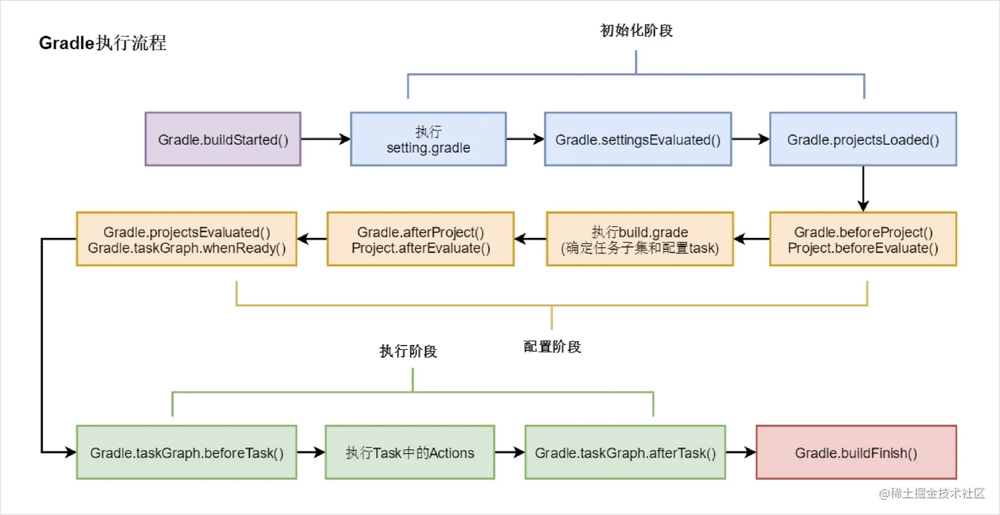
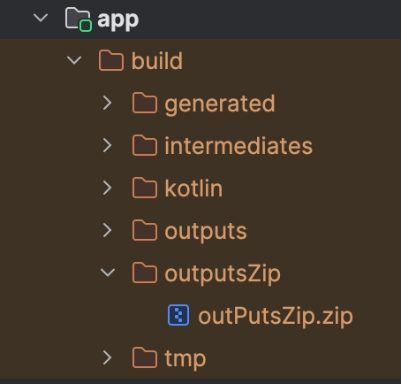
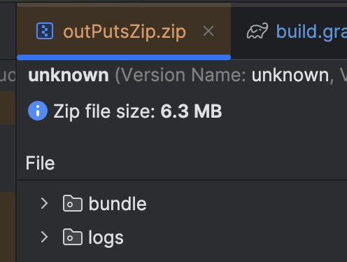

# Lab2
## Gradle核心模型
### gradle的钩子函数
gradle的执行流程图如下



如图，gradle在初始化、配置、执行阶段都有各自的钩子函数来处理自定义的构建逻辑。  
gradle同时也能监听各阶段的回调处理：
* gradle.addProjectEvaluationListener
* gradle.addBuildListener
* gradle.addListener

coding验证，首先新建一个As基础项目，在Project的build.gradle中写入
```gradle
// Top-level build file where you can add configuration options common to all sub-projects/modules.
plugins {
alias(libs.plugins.android.application) apply false
    alias(libs.plugins.jetbrains.kotlin.android) apply false
}

// Gradle提供的钩子函数
// 配置阶段：
gradle.beforeProject {
    println "gradle.beforeProject"
}
gradle.afterProject {
    println "gradle.afterProject"
}
gradle.taskGraph.whenReady {
    println "gradle.taskGraph.whenReady"
}
beforeEvaluate {
    println "beforeEvaluate"
}
afterEvaluate {
    println "afterEvaluate"
}

// 为gradle设置监听
gradle.addProjectEvaluationListener(new ProjectEvaluationListener() {
    @Override
    void beforeEvaluate(Project project) {
        println "Configure listener beforeEvaluate"
    }

    @Override
    void afterEvaluate(Project project, ProjectState state) {
        println "Configure listener afterEvaluate"
    }
})


gradle.addBuildListener(new BuildListener() {

    void buildStarted(Gradle gradle) {
        println "Build listener buildStarted"
    }

    @Override
    void settingsEvaluated(Settings settings) {
        println "Build listener settingsEvaluated"
    }

    @Override
    void projectsLoaded(Gradle gradle) {
        println "Build listener projectsLoaded"
    }

    @Override
    void projectsEvaluated(Gradle gradle) {
        println "Build listener projectsEvaluated"
    }

    @Override
    void buildFinished(BuildResult result) {
        println "Build listener buildFinished"
    }
})

task runTask{
    println "configure runTask gradleLearningProjectLab2"
    doFirst {
        println "doFirst runTask gradleLearningProjectLab2"
    }
}

```
执行gradle runTask(若遇到了JDK版本问题，可以参考)，输出如下：
```shell
> Configure project :
configure runTask gradleLearningProjectLab2
Configure listener afterEvaluate
gradle.afterProject
afterEvaluate

> Configure project :app
Configure listener beforeEvaluate
gradle.beforeProject
Configure listener afterEvaluate
gradle.afterProject
Build listener projectsEvaluated
gradle.taskGraph.whenReady

> Task :runTask
doFirst runTask gradleLearningProjectLab2
Build listener buildFinished
```

### Gradle守护进程Daemon
在项目启动时会开启一个client，在client中会启动一个daemon，client会和daemon建立长链接，当client关闭时，Daemon会保持启动，此时若有类似项目部署时，会通过新的client向daemon发送构建请求，此时构建速度就会非常快。  
daemon默认存在3小时，可使用 --no-daemon 参数关闭。  
运行项目时以下输出代表daemon相关操作:
```shell
Connected to the target VM, address
Disconnected from the target VM, address
```
### Gradle属性扩展
在gradle中可以使用ext对任意对象进行扩展
* 对project进行扩展，其子project也会继承该属性
* 由谁进行ext调用，就会对谁进行扩展，即ext调用者是扩展对象的所有者
* 属性扩展相当于创建闭包，直接使用未定义的属性会创建

使用时可以直接使用ext.xxx的方式访问，也可以使用属性扩展的方式访问。  
coding验证，在Project的build.gradle中写入
```gradle
ext {
    extA = 'extA'
    extB = 'extB'
}

ext.extC = 'extC'

println project.ext.extA
println ext.extB
println extC

task runTask{
    println 'runTask\t' + project.ext.extA
    println 'runTask\t' + project.extB
    println 'runTask\t' + extC
}
```  
执行gradle runTask，输出如下：
```shell
> Configure project :
extA
extB
extC
runTask	extA
runTask	extB
runTask	extC
```  

可以看到，因为是在当前project的build.gradle中声明的扩展，可以通过

- project.ext.xxx
- project.xxx
- ext.xxx
- xxx

的方式访问。  
而在app的build.gradle中，可以通过project.xxx的方式访问。
```gradle
task runAppTask {
    println 'runAppTask\t' + project.extA
    println 'runAppTask\t' + project.extB
    println 'runAppTask\t' + project.extC
}
```
app输出如下
```shell
> Configure project :app
runAppTask	extA
runAppTask	extB
runAppTask	extC
```
可以看出，对project扩展的属性，对所有子project都可见。  
上述方式都是在.gradle中配置的扩展属性，在gradle.properties中也可以进行扩展.
```
//gradle.properties
MIN_SDK_VERSION=24
TARGET_SDK_VERSION=34
COMPILE_SDK_VERSION=34
```  
在app的.gradle中可以通过以下方式访问
```gradle
android {
    ...
    compileSdk Integer.parseInt(COMPILE_SDK_VERSION)

    defaultConfig {
        ...
        minSdk Integer.parseInt(MIN_SDK_VERSION)
        targetSdk Integer.parseInt(TARGET_SDK_VERSION)
        ...
    }
    ...
}
```
在app的build.gradle中，通过打印输出验证一下
```gradle
task versionLog{
    println 'MIN_SDK_VERSION: ' + MIN_SDK_VERSION
    println 'COMPILE_SDK_VERSION: ' + COMPILE_SDK_VERSION
    println 'TARGET_SDK_VERSION: ' + TARGET_SDK_VERSION
}
```
执行gradle versionLog，输出如下，符合预期：
```shell
MIN_SDK_VERSION: 24
COMPILE_SDK_VERSION: 34
TARGET_SDK_VERSION: 34
```
## Gradle自定义任务
先前的实验中，我们的交互方式都是通过println打印输出，那么如何进行更加复杂的逻辑操作呢，gradle提供了task的概念，可以自定义任务。  
我们可以在build.gradle中自定义任务
- task就是对DefaultTask的实现，可以通过task.doFirst、task.doLast、task.dependsOn等方法来进行任务的配置
- 可以使用自定义类继承DefaultTask:
    - 使用@TaskAction注解标记方法，该方法会被gradle执行
    - 使用@Input注解表示任务的输入参数
    - 使用@OutputFile表示任务的输出文件
    - 使用inputs,outputs设置任务的输入输出
    - 一个任务的输出可以作为另一个任务的输入(存在隐式依赖)

### Demo1.文件数据写入
build.gradle:

```gradle
class WriteFileTask extends DefaultTask {
    @TaskAction
    void writeFile() {
        println "writeFile()"
        def inFile = inputs.files.singleFile
        def outFile = outputs.files.singleFile
        outFile.createNewFile()
        outFile.text = inFile.text
    }
}

task writeFileTask(type: WriteFileTask) {
    inputs.file file('app/src/main/java/com/example/gradlelearningproject/MainActivity.kt')
    outputs.file file('text.txt')
}
```  
执行gradle writeFileTask，目录新增text.txt文件，内容与MainActivity.kt一致.

### Demo2.文件压缩

app - build.gradle
```gradle
task outPutsZip(type: Zip) {
    // 压缩build/outputs
    archiveFileName = 'outPutsZip.zip'
    println "outPutsZip println: " + buildDir
    destinationDirectory =  file("${buildDir}/outputsZip")
    from "${buildDir}/outputs"
}

task deleteZipFolder(type: Delete) {
    // 删除 build 目录下的 outputsZip 文件夹
    delete "${buildDir}/outputsZip"
}
```
执行gradle outPutsZip，build目录新增outputsZip/outPutsZip.zip文件.

<div style="display: flex; align-items: center;">
    
    
</div>  

执行gradle deleteZipFolder，可以删除build目录下的outputsZip文件夹.

